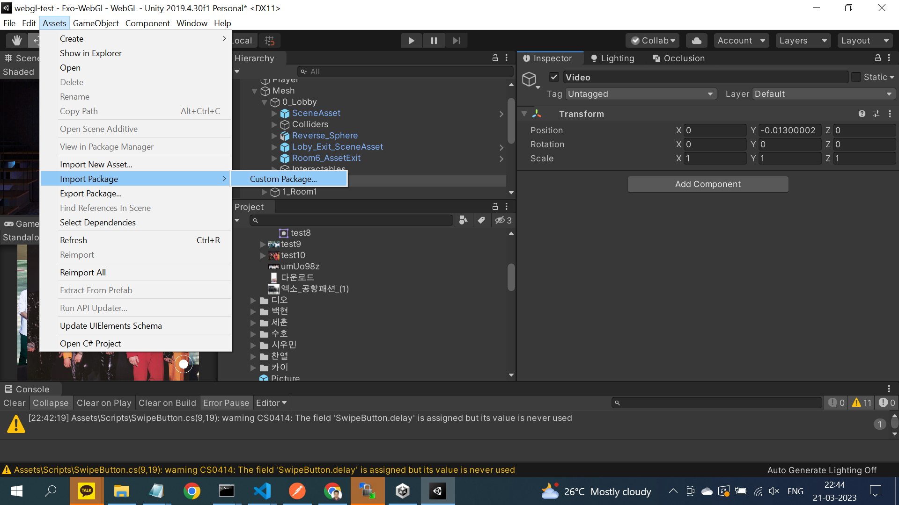

<h1  style="line-height:2;">
<a  href="https://www.onnetsystems.net/contact.html"  target="_blank"></img></a>

  

 

# OnnPlayer - Video streamig Player for Unity WebGL

 OnnPlayer™ for Unity is a Adaptive bit rate video streaming player for WebGL based Unity games and apps supported on Chome and Safari on Android, iOS, Windows and macOS. OnnPlayer's Unity video plugin also supports <b>Widevine DRM-protected</b> HLS & DASH streaming on <b>Chrome</b> and <b>Fairplay DRM-protected</b> HLS streaming on <b>Safari</b>.

  

This repository contains the OnnPlayer™ Unity  WebGL video streaming player plugin features list as well as an installation guide. If you want to get a copy of our fully working demo, contact us at [Onnet Systems](https://www.onnetsystems.net/contact.html).

  

## Demo Examples

  

Our Unity video plugin allows the introduction of new exciting scenes within your Unity projects. With our plugin, you can use in-game actions and objects to modify video content.

  

## [Our Unity Use Cases](https://d1j2x89u6hjw6s.cloudfront.net/)

 WebGL: Browser-based metaverses|

  

## Table of Contents

  

*  **[Features](#features)**

  

*  **[Supported Platforms](#supported-platforms)**

  

*  **[Demo Installation Guide](#demo-installation-guide)**

 

  

## Features

  

The OnnPlayer™ for Unity WebGL video streaming player plugin contains the latest features. As our Unity video plugin is developed entirely in-house, we can implement any desired functionalities.

  

We support the following features:

  

<table>

<tbody  style="text-align:center;">

<tr>

<td  valign="top"  style="text-align:center;">

<b>Overview</b>

</td>

<td>

<ul>

<li>mp4 download and playback</li>

<li>HLS & DASH Streaming with ABR (Adaptive Bitrate)</li>

<li>AES-128 HLS</li>

<li>Widevine DRM for Streaming</li>

<li>Fairplay DRM for Streaming</li>

<li>Up to 8K (UHD) Resolution</li>

<li>Rendering Videos on 2D & 3D Objects</li>

</ul>

</td>

<tr>

<td  valign="top"  style="text-align:center;">

<b>Basic Features</b>

</td>

<td>

<ul>

<li>Auto Playback</li>

<li>Play / Pause</li>

<li>Seek</li>

<li>Audio Volume Adjustment</li>

<li>Loop Playback</li>

<li>Configurable Aspect Ratio</li>

<li>Portrait / Landscape Orientation</li>

</ul>

</td>

</tr>

</tbody>

</table>

  

## Supported Platforms

| Platform | Supported Graphics APIs | HLS | DASH | Fair Play | Widevine |
| :-----:| :-----:| :-----:| :-----:| :-----:| :-----:|
| Android chrome | WebGL 2.0 | :heavy_check_mark: | :heavy_check_mark: | | :heavy_check_mark: | :heavy_check_mark: |
| iOS Chrome | WebGL 2.0 | :heavy_check_mark: | :heavy_check_mark: |  | :heavy_check_mark: | :heavy_check_mark: |
| Windows Chrome | WebGL 2.0 | :heavy_check_mark: | :heavy_check_mark: |  | :heavy_check_mark: |
|macOS Chrome|WebGL 2.0|:heavy_check_mark:|:heavy_check_mark:||:heavy_check_mark:|
|iOS Safari|WebGL 2.0|:heavy_check_mark:|:heavy_check_mark:|:heavy_check_mark:|
|macOS Safari|WebGL 2.0|:heavy_check_mark:|:heavy_check_mark:|:heavy_check_mark:||
  

## Demo Installation Guide

###  In a new Unity metaverse application,  
- **Assets > Import package > Custom Package and select OnnetVideoPlayer.package**

### Create New Quad Object and assign a name to the quad object

### Attach a box collider component to the quad game object and set IsTrigger property to true.

### Add New component to the quad object and select Onnet Video Player script.

### Fill the details in Player component

### Set the metaverse application to use the custom webgl template by following the step below.
    

-   In Unity 2019.4.30f1 Editor, Go to Player settings  
    (menu: Edit > Project Settings > Player), and set the platform-specific settings to WebGL.
    
-   Open Resolution and Presentation.
    
-   Under WebGL Template Select Onnet Template

### Create a new material with shader property as Unlit/texture and assign this material to the new quad object’s mesh renderer

  
  

## Contact

[Onnet Systems](mailto:contact@onnetsystems.net)
